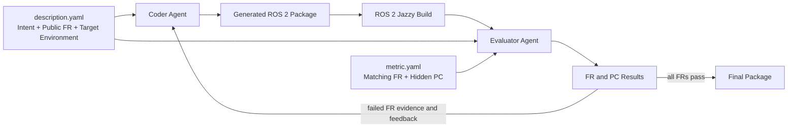

# ROS 2 Code Generation Benchmark for Large Language Models

This repository evaluates whether a large language model can generate a
functionally correct ROS 2 package from a public structured description.

The benchmark measures functional behavior rather than source-code similarity.
A generated package may use a different language, package layout, node
decomposition, algorithm, or implementation technique when those choices are
not required by the public functional requirements.

> **Format status:** This branch uses the revised public-FR/hidden-PC format.
> Benchmark data, templates, format documents, and the Benchmark MCP
> registry/tests/output contract have been migrated. The separate ROS_MA
> orchestrator and Evaluator integration still needs to adopt the PC-level
> result contract before an end-to-end release.

## Benchmark Unit

Each benchmark case contains two required artifacts and may retain one optional
authoring archive:

| Artifact | Purpose | Coder | Evaluator |
| --- | --- | --- | --- |
| `description.yaml` | Defines package intent, public functional requirements, and an optional target environment. | Visible | Visible |
| `metric.yaml` | Repeats the public FRs and defines hidden pass criteria for each FR. | Hidden | Visible |
| `reference/` | Optional authoring material retained for provenance or manual review. It is not an evaluation input. | Hidden | Hidden |

The ordered `(id, text)` pairs in
`description.functional_requirements` must exactly equal those in
`metric.metrics`.

## Visibility Boundary

```text
Coder Agent
└── description.yaml
    ├── intent
    ├── functional_requirements
    └── target_environment (optional)

Evaluator Agent
├── description.yaml
├── metric.yaml
│   └── matching FRs
│       └── hidden pass criteria
└── immutable generated-package artifact and build result
```

The Coder never receives `metric.yaml` or its pass criteria. The Evaluator
receives the same public FRs as the Coder and uses the hidden PCs only to make
the evaluation reproducible and granular.

## Evaluation Workflow



## Description Format

`description.yaml` is the complete Coder-visible package specification.

| Section | Required | Purpose |
| --- | --- | --- |
| `intent` | Yes | Identifies the package and summarizes its purpose and responsibility boundary. |
| `functional_requirements` | Yes | Lists public observable behaviors supplied to both Coder and Evaluator. |
| `target_environment` | No | Identifies the robot, sensor, or system environment when it materially constrains implementation. |

```yaml
intent:
  package_name: turtlebot3_follower
  summary: >-
    Coordinates a chain of TurtleBot3 followers through Nav2 FollowPath.
  scope: >-
    Provides follower logic and launch orchestration; robot drivers,
    localization, and actuation are external.

functional_requirements:
  - id: FR-1
    text: >-
      The follower executable accepts a requested follower count and creates
      one follower node for each index.

target_environment: >-
  A multi-robot system using TurtleBot3 mobile robots.
```

### Description Rules

- `intent.package_name` must match the benchmark case directory.
- FR IDs start at `FR-1`, remain sequential, and are not duplicated.
- FR text describes observable required behavior without prescribing incidental
  implementation structure.
- `target_environment` is a short context statement, not an interface inventory.
- Omit `target_environment` for platform-independent utilities when it adds no
  implementation-relevant information.
- `interfaces` is not part of the revised Description format.

## Metric Format

`metric.yaml` contains the same ordered FRs as the public Description and adds
Evaluator-only pass criteria directly below each FR.

```yaml
package_name: turtlebot3_follower

metrics:
  - id: FR-1
    text: >-
      The follower executable accepts a requested follower count and creates
      one follower node for each index.
    pass_criteria:
      - id: FR-1-PC-1
        text: >-
          The follower executable accepts a requested follower count.
      - id: FR-1-PC-2
        text: >-
          Exactly one follower node is created for each requested index.
```

### Metric Rules

- `package_name` must match both the case directory and Description package name.
- `metrics[].id` and `metrics[].text` must exactly match the Description FRs.
- Every FR has at least one PC.
- PC IDs use `FR-<n>-PC-<n>` and remain sequential within their parent FR.
- One PC represents one independently verifiable behavior whenever practical.
- A PC must be directly derivable from its public parent FR and must not add a
  hidden requirement.
- PCs describe observable behavior, not reference function names, callbacks,
  loops, helpers, file paths, or source layout.
- PC entries contain only `id` and `text`.
- `evaluation`, `reference`, `reference_evidence`, `requirement_ids`, paths,
  anchors, snippets, and explanations are not part of the revised Metric format.

All current PCs are evaluated statically from immutable generated-package
artifacts. Per-PC evaluation mode is a framework-level policy and is not
repeated in each Metric entry.

## Result Aggregation

```text
all PCs for one FR pass     -> FR pass
one or more PCs fail        -> FR fail
all FRs pass + build passes -> Static Gate pass
```

Candidate evidence must come from the generated package, not from an optional
reference archive. Evaluator feedback identifies missing or contradictory
observable behavior without requiring a particular reference implementation.

## Reference Policy

Existing `reference/` directories may be retained as optional authoring archives
while the format is stabilized. They may be consulted manually when reviewing
historical case intent, but:

- neither MCP profile registers reference-file resources;
- the Evaluator does not use reference code to judge a candidate;
- Metric files do not contain reference evidence;
- generated code is never compared for source similarity.

The checked-in registry does not require a `reference/` directory. Retaining
one is an authoring choice and does not make reference code an Agent input or
an evaluation source.

## MCP Server

The runnable MCP implementation under [`mcp/`](mcp/) provides fixed Coder and
Evaluator profiles. See [mcp/README.md](mcp/README.md) for resource boundaries,
tool contracts, installation, and local-build security constraints.

The Benchmark MCP validates the FR-to-PC data contract and the explicit per-PC
Evaluator result schema. The external ROS_MA orchestrator and Evaluator must
still be updated to emit and consume that contract; consult the status note
above before treating this branch as a released end-to-end benchmark.

## Repository Layout

```text
.
├── README.md
├── docs/
├── mcp/
├── benchmarks/
│   ├── README.md
│   └── <package_name>/
│       ├── description.yaml
│       ├── metric.yaml
│       └── reference/       # optional authoring archive
└── templates/
```

Each direct child of `benchmarks/` is one independently evaluated case.
`intent.package_name` and `metric.package_name` must match that directory name.
If an optional reference archive is retained, its `package.xml` name must also
match.

## Authoring Checklist

Before accepting a case:

1. Confirm that Description and Metric FR IDs, order, and text match exactly.
2. Confirm that every PC is supported by its public FR.
3. Remove implementation-specific or reference-specific wording from PCs.
4. Add `target_environment` only when it provides material generation context.
5. Validate the case with the repository migration/validation scripts.
6. Confirm that the Coder profile cannot access the hidden Metric.
7. Confirm that the Evaluator cites only generated-package evidence.
